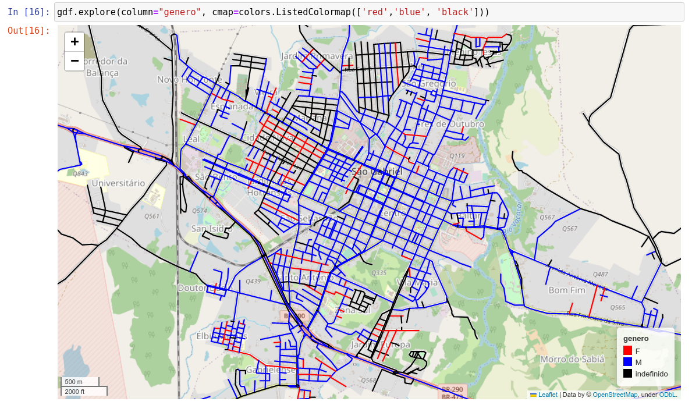

# ruas-e-seus-nomes

# Ruas e seus nomes

Inspirado no trabalho [Porto - Ruas do Género](https://ruasdogenero.pt/) O objetivo deste repositório é classificar ruas por seus nomes atribuídos e entender melhor a organização de cidades, permeadas por relações de poder e gênero que se materializam na toponímia urbana. A dicotomia masculino/feminino não reflete a visão do autor sobre identidades de gênero e foi seguida pelo fato de o dataset utilizado (criado por [Álvaro Justen](https://github.com/turicas/genero-nomes) e obtido/tratado a partir do IBGE) classificar as ruas em dois gêneros: M (masculino) e F (feminino).

